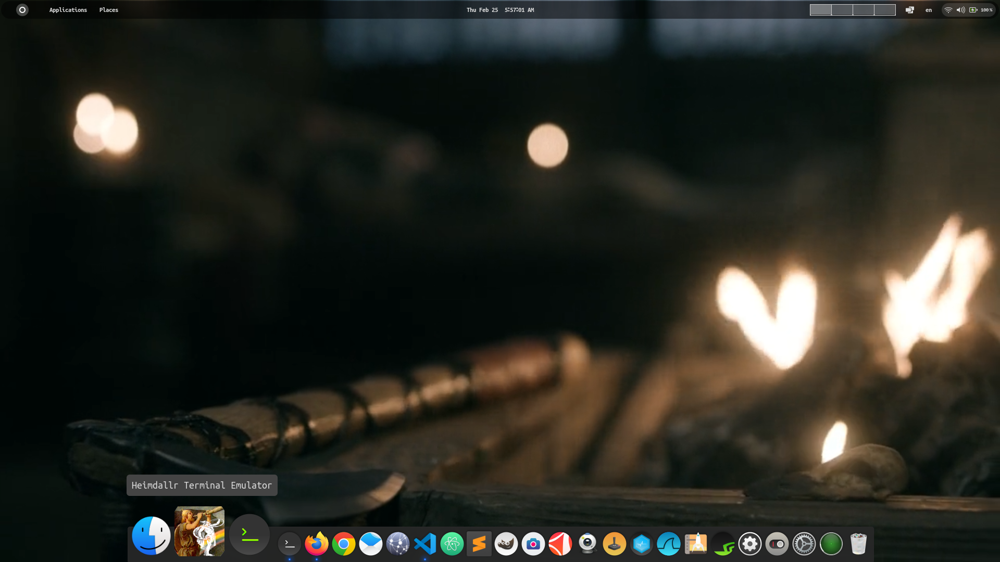

# LazyCat Terminal Emulator (Debian application)

This lightweight and fast terminal, written in C and Gtk framework, is designed to be your permanent choice.

SIZE: 19KB :D

after compile!

# screenshots





# Remember the following text for system-wide installation on Debian:
```
$ cd debian
$ make install
```


# Please remember the following steps for local execution:
1. Navigate to the "Debian" directory by entering the command: $ cd debian
2. Build the executable by running the command: $ make
3. Execute the program by typing: $ ./lazyCat
