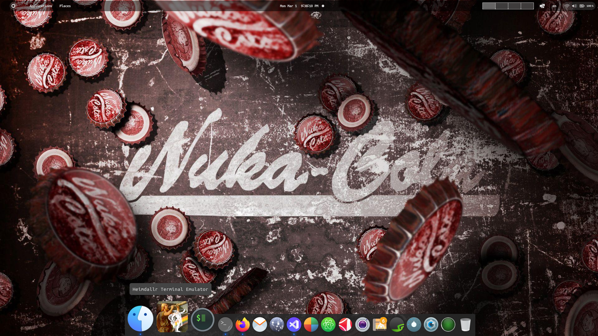

# LazyCat Terminal Emulator (Debian application)

A terminal,
We are focused on its lightness and speed!
Finally, it can be a permanent terminal for you!
this terminal, written in C and Gtk framework
because HEIMDALLR must be SUPER lightweight.

SIZE: 19KB :D

after compile!

# screenshots

# installation (Debian)
    $ cd debian
    $ make install 

# exec (local)
    $ cd debian
    $ make
    $ ./lazyCat

